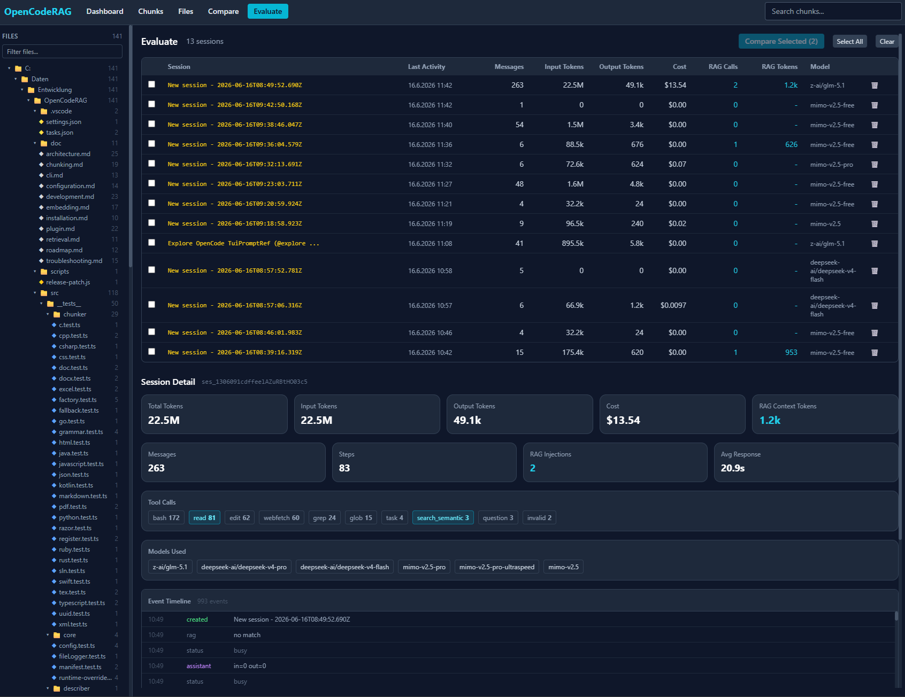

# OpenCodeRAG

OpenCodeRAG is a **local-first RAG plugin** for semantic code and image search. It converts your codebase into vector indices and retrieves relevant code chunks on natural language queries. The primary aim is to save tokens by replacing full-file reads with targeted chunk retrieval and to speed-up tool calls for large codebases. Integrates seamlessly with [OpenCode](https://opencode.ai) and works as a standalone MCP server or CLI tool for other AI harnesses.

You don't need a dedicated GPU to run smaller embedding LLMs, as these models can still run performant on modern CPUs.

[](https://www.npmjs.com/package/opencode-rag-plugin)

> ⚠️ **Note:** Don't confuse this with the npm package `opencode-rag` (a discontinued project by a different author).

## Quick Start

```bash
# 1. Install globally (automatically sets up the OpenCode runtime)
npm install -g opencode-rag-plugin

# 2. Initialize in your project
cd /path/to/your/project
opencode-rag init

# 3. Index your workspace
opencode-rag index

# 4. CLI search test
opencode-rag query "authentication middleware"
```

**Prerequisites:** Node.js v22+, [Ollama](https://ollama.ai) (default) or other LLM-hosters (OpenAI-, Google- or Anthropic-compatible).

> **Contributors / developers:** Clone the repo and use `npm install --legacy-peer-deps; npm run build; opencode-rag setup --force` — see [Development docs](doc/development.md).

## Key Features

| Feature | Description |
|---|---|
| **MCP server** | `opencode-rag mcp` - stdio-based MCP server exposing `search_semantic`, `get_file_skeleton`, `find_usages`, and `describe_image` tools for any MCP-compatible client |
| **AST chunking** | 26 languages via tree-sitter (TS, JS, Python, Java, Go, Rust, C/C++, C#, Ruby, Kotlin, Swift, Bash, PHP, PowerShell, SQL, JSON, HTML, CSS, XML (including SVG), YAML, TOML, INI, Dockerfile, Markdown, LaTeX, Razor) |
| **Document support** | Markdown, LaTeX, PDF, DOCX, DOC, Excel |
| **Image indexing** | Describe images via vision LLM and store descriptions as searchable vector chunks |
| **Hybrid search** | Vector similarity + TF×IDF keyword fusion |
| **OpenCode plugin** | Auto-inject context, read-tool override, TUI settings, Ctrl+Enter to add RAG context, MCP registration on `init` |
| **Incremental indexing** | File-hash manifest, background watcher, auto-rebuild on corruption |
| **Privacy-first** | All processing stays local (when using Ollama) |
| **CLI Tools** | `index`, `query`, `status`, `list`, `show`, `dump`, `clear`, `init`, `ui`, `mcp` |
| **Proxy-aware** | Corporate proxy support with raw-socket localhost bypass |
| **OpenAI / Anthropic / Cohere** | Use alternate embedding providers with API key auto-resolution |
| **Evaluation** | Session-level token tracking, RAG-on vs RAG-off comparison, tiktoken BPE counting |

## Web UI

A browser-based dashboard for exploring the indexed vector database - browse and inspect chunks and evaluate the OpenCode sessions in terms of retrieved chunks, consumed tokens and more.



Launch with `opencode-rag ui`. See [Web UI documentation](doc/webui.md) for details.

## Documentation

| Document | Contents |
|---|---|
| [Architecture](doc/architecture.md) | Module design, data flow, tech stack |
| [Installation](doc/installation.md) | Full install guide, global setup, uninstall |
| [Configuration](doc/configuration.md) | All options: embedding, indexing, retrieval, description, image description, plugin |
| [Chunking](doc/chunking.md) | Language matrix, adding new chunkers, custom chunkers |
| [Embedding](doc/embedding.md) | Providers, model recommendations, proxy, dimension probing |
| [Retrieval](doc/retrieval.md) | Pipeline, hybrid search, score fusion, caching |
| [Plugin](doc/plugin.md) | OpenCode integration, tools, hooks, TUI, troubleshooting |
| [CLI Reference](doc/cli.md) | All commands, options, examples |
| [Web UI](doc/webui.md) | Dashboard, chunk browser, file explorer, compare view |
| [Evaluation](doc/evaluation.md) | Token analysis, session logging, benchmark runner, accuracy guide |
| [Development](doc/development.md) | Setup, testing, conventions, adding providers |
| [Troubleshooting](doc/troubleshooting.md) | Common issues, logging, debugging |
| [Roadmap](doc/roadmap.md) | Completed items, short/mid/long-term plans |

## Image Indexing

OpenCodeRAG can index image files (PNG, JPEG, WebP, etc.) by sending them to a vision-capable LLM and storing the generated text descriptions as searchable vector chunks. This makes visual assets discoverable via natural language queries (e.g., "login screen screenshot", "architecture diagram").

**Supported providers:** Ollama, OpenAI, Anthropic, Google Gemini compatible providers.

**Disabled by default** — enable in `opencode-rag.json` to opt in (recommended for dedicated GPUs).

## MCP Server

OpenCodeRAG ships a CLI-based [MCP (Model Context Protocol)](https://spec.modelcontextprotocol.io/) server that exposes semantic code tools to any MCP-compatible client (Claude Desktop, OpenCode, Cursor, etc.).

```bash
opencode-rag mcp
```

### MCP Tools

| Tool | Description |
|------|-------------|
| `search_semantic` | Vector + keyword hybrid search across the indexed codebase |
| `get_file_skeleton` | AST-based file outline (functions, classes, methods) |
| `find_usages` | Find all references to a symbol by name |
| `describe_image` | Return the pre-generated description for an indexed image file |

Clients can configure the MCP server manually, or `opencode-rag init` auto-registers it.

## Agent Discovery

OpenCodeRAG registers tools that agents can invoke directly. Agents discover these tools via the OpenCode **skill system** - when `opencode-rag init` runs, it creates `.opencode/skills/opencode-rag/SKILL.md` which teaches agents the recommended workflow:

1. **Skeleton first** - `get_file_skeleton(filePath)` to orient in a file
2. **Find usages** - `find_usages(symbolName)` before editing any symbol
3. **Search** - `search_semantic(query)` to find relevant code
4. **Describe images** - `describe_image(filePath)` when context involves an image
5. **Read** - use `read` on specific line ranges
6. **Edit** - make changes with full context

### Available Tools

| Tool | Purpose | When to Use |
|------|---------|-------------|
| `search_semantic` | General-purpose code retrieval | Before any code task when you haven't read the relevant code |
| `get_file_skeleton` | Quick file overview via AST | Before reading a large file to decide which sections matter |
| `find_usages` | Symbol reference search | **Before editing** any function, variable, or class |
| `describe_image` | Retrieve pre-generated image description | When a user asks about a screenshot, diagram, or visual asset |
| `read` (optional) | RAG-enhanced file read | Full file contents with supplementary context chunks |

## OpenCode Integration

When using OpenCode, the plugin enhances your agent with three discovery mechanisms:

### 1. Skill-Based Discovery (Recommended)
`opencode-rag init` creates `.opencode/skills/opencode-rag/SKILL.md` - an OpenCode skill that teaches agents the tool workflow. Agents load it on demand via the `skill` tool, keeping token overhead minimal.

### 2. System Prompt Guidance (Conditional)
When chunks are indexed, a brief tool list is prepended to the system prompt so agents know the tools exist. This is skipped when no chunks are indexed to save tokens.

### 3. On-Demand RAG Context (Ctrl+Enter / Ctrl+Alt+Enter)
Press **Ctrl+Enter** in the terminal prompt to retrieve and append a relevant file list to your current prompt. Press **Ctrl+Alt+Enter** to append full code chunks instead. The query is taken from your typed text - if the prompt is empty, a toast reminds you to type first. Results are appended directly to the prompt as formatted code blocks with file paths, line ranges, and relevance scores. No dialogs are opened. Keybindings are configurable in the settings menu (Ctrl+Shift+R).

---

## Evaluation & Token Analysis

OpenCodeRAG tracks token usage, RAG injection overhead, and costs across sessions. Compare RAG-on vs RAG-off to measure whether semantic retrieval saves tokens.

```bash
opencode-rag eval:sessions          # list sessions
opencode-rag eval:analyze <id>      # detailed breakdown
opencode-rag eval:compare <A> <B>   # side-by-side comparison
```

Token counting uses tiktoken BPE (cl100k_base) for accurate code tokenization. See [Evaluation documentation](doc/evaluation.md) for details.

---

## Privacy & Security

**100% local by default.** By default, embeddings are generated locally via Ollama. The vector database stays in your project directory. **No source code or embeddings leave your machine** unless you explicitly configure to use a third-party API.

## License

MIT
